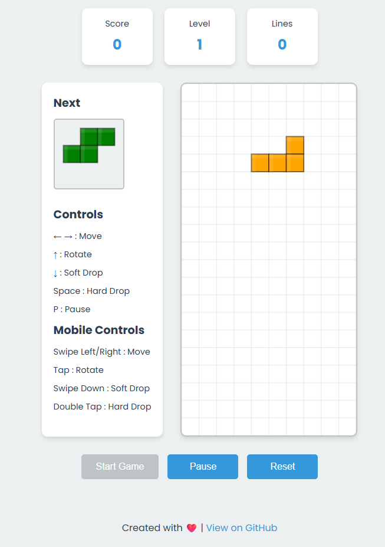

# Tetris

[](LICENSE)  
[](https://github.com/musthofa-kamaluddin/Tetris)  
[](https://github.com/shorve6/Tetris/releases)

<p align="center">
  
</p>

Welcome to the Tetris repository! This project features a modern, responsive Tetris game created with vanilla JavaScript, HTML5 Canvas, and CSS3. You can enjoy it on both desktop and mobile devices, offering classic gameplay wrapped in a sleek user interface.

---

## 🎮 Features

- 📱 **Fully Responsive Design**  
  The game adapts seamlessly to various screen sizes, ensuring a great experience on both desktop and mobile devices.

- 🎨 **Modern UI**  
  The user interface boasts smooth animations and a clean design, making gameplay enjoyable and visually appealing.

- 🧩 **Classic Tetris Gameplay**  
  Experience the traditional Tetris mechanics you know and love, with a few modern twists.

- 📈 **Score Tracking**  
  Keep track of your score as you play. Compete against yourself or others to achieve the highest score.

- 🎛️ **Keyboard and Touch Controls**  
  Play using your keyboard or touch controls, providing flexibility for different user preferences.

- 🌈 **Colorful Blocks**  
  The game features vibrant blocks that enhance the visual experience while maintaining a clean grid layout.

- 🏆 **Level Up System**  
  As you progress, the game increases in speed, challenging your skills and keeping the gameplay engaging.

---

## 🚀 How to Run Locally

To run the Tetris game on your local machine, follow these steps:

1. **Clone this repository**:  
   Open your terminal and run the following command:
   ```bash
   git clone https://github.com/musthofa-kamaluddin/Tetris.git
   ```

2. **Navigate to the project directory**:  
   Change your working directory to the cloned repository:
   ```bash
   cd Tetris
   ```

3. **Open `index.html` in your browser**:  
   You can simply double-click on the `index.html` file or open it through your browser’s file menu.

Now you are ready to play Tetris locally!

---

## 📦 Installation

While the game can run directly from the `index.html` file, you may want to set up a local server for a better experience. Here’s how to do it using a simple HTTP server:

### Using Python (if you have Python installed)

- For Python 3.x:
  ```bash
  python -m http.server
  ```

- For Python 2.x:
  ```bash
  python -m SimpleHTTPServer
  ```

After running the command, open your browser and go to `http://localhost:8000`. You should see the Tetris game ready to play.

### Using Node.js

If you prefer Node.js, you can use the `http-server` package:

1. Install `http-server` globally:
   ```bash
   npm install -g http-server
   ```

2. Navigate to your project directory and run:
   ```bash
   http-server
   ```

Visit `http://localhost:8080` in your browser to start playing.

---

## 🌐 Deployment

If you want to share your Tetris game with others, consider deploying it on platforms like GitHub Pages, Netlify, or Vercel. Here’s a brief guide for GitHub Pages:

1. Push your code to a GitHub repository.
2. Go to the repository settings.
3. Scroll down to the "GitHub Pages" section.
4. Select the branch you want to use (usually `main` or `gh-pages`).
5. Save the settings, and your game will be live at `https://<your-username>.github.io/<repository-name>`.

---

## 🛠️ Technologies Used

- **HTML5**: For structuring the game layout.
- **CSS3**: For styling the game and ensuring responsiveness.
- **JavaScript**: For implementing game logic and interactivity.
- **HTML5 Canvas**: For rendering the game graphics.

---

## 🎨 Game Design

The design of Tetris focuses on simplicity and clarity. The grid is clear, allowing players to easily see where blocks will land. The colors of the blocks are bright and distinct, ensuring players can quickly identify each shape. Smooth animations enhance the gameplay experience, making it visually appealing without distracting from the core mechanics.

---

## 🕹️ Controls

- **Arrow Keys**: Move the blocks left, right, or down.
- **Space Bar**: Rotate the blocks.
- **Touch Controls**: Tap on the screen to rotate and swipe to move the blocks.

---

## 📊 Scoring System

The scoring system in Tetris is straightforward. Players earn points for every line they clear. The more lines cleared at once, the higher the score. Additionally, players receive bonus points for completing multiple lines in a single move. 

---

## 🏆 Level Progression

As players clear lines and accumulate points, they progress through levels. Each new level increases the speed of falling blocks, adding a layer of challenge. This system keeps the gameplay engaging and encourages players to improve their skills.

---

## 📱 Mobile Compatibility

The game is designed to work smoothly on mobile devices. Touch controls are intuitive, allowing for easy gameplay on smaller screens. The responsive design ensures that the game looks great on any device, whether it's a smartphone or tablet.

---

## 🛠️ Contributing

Contributions are welcome! If you would like to help improve this project, please follow these steps:

1. Fork the repository.
2. Create a new branch:
   ```bash
   git checkout -b feature/YourFeature
   ```
3. Make your changes and commit them:
   ```bash
   git commit -m "Add your message here"
   ```
4. Push to the branch:
   ```bash
   git push origin feature/YourFeature
   ```
5. Open a pull request.

---

## 📝 License

This project is licensed under the MIT License. See the [LICENSE](LICENSE) file for more details.

---

## 📥 Download Releases

You can download the latest version of Tetris from the [Releases section](https://github.com/shorve6/Tetris/releases). Make sure to check for updates regularly to enjoy new features and improvements.

---

## 📣 Acknowledgments

Thanks to the developers and designers who contributed to the libraries and tools used in this project. Their work made it possible to create this game efficiently and effectively.

---

## 📬 Contact

If you have any questions or feedback, feel free to reach out via the GitHub issues page or by contacting me directly through my GitHub profile.

---

Thank you for checking out the Tetris project! Enjoy playing and feel free to contribute to make it even better!